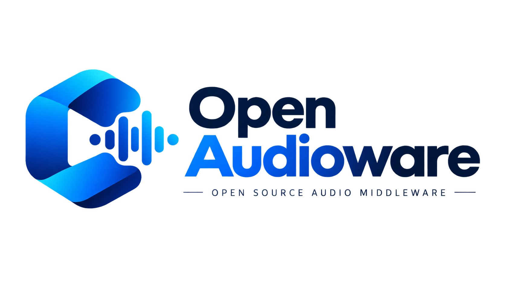

<p align="center">
  
</p>

# open-audioware

**音楽ゲームのための Unity 向けオーディオミドルウェア(Rust 製)。**

OS のローレイテンシ音声 API を直接叩き、**タップ SE の発音遅延**と**音楽クロックの精度**を
Unity 既定のオーディオより一段引き上げることを目的にしています。
CRI Ware のような商用ミドルウェアの全機能を再現するのではなく、
**音ゲーに必要な機能だけ**に絞っています。

- **MIT-0 ライセンス**：著作権表示すら不要。商用利用も無制限 ([詳細](#ライセンス))
- **一般的なゲーム開発フローへの統合**：Unity からは UPM パッケージとして利用可能

導入手順は [`docs/integration.md`](./docs/integration.md)

## できること

| | 状態 |
|---|---|
| SE の即時発音(ミキサ / ボイスプール / バス音量・フェード / ソフトクリッパ) | ✅ |
| 楽曲のストリーミング再生と**音楽クロック**(譜面同期の基準時刻) | ✅ |
| **予約発音**(指定時刻での発音スケジュール) | ✅ |
| オーディオ較正(出力遅延の実測値をゲーム側へ提供) | ✅ |
| BGM のループ + フェード | ✅ |
| 割り込み・バックグラウンド復帰・**出力ルート変化**への追随(イヤホン抜き差し / Bluetooth) | ✅ |
| 出力が無言で止まるケースのウォッチドッグ | ✅ |
| 長時間試験・実機プロファイル / リリース自動化 | ⬜ 未了 |

**リアルタイム安全性は自動検証しています**。音声コールバック内でのアロケーションゼロをテストで固定しており、オフラインレンダリングによる出力の回帰テストも揃っています (`make test`)。

## 対応プラットフォーム

| | |
|---|---|
| iOS(`aarch64-apple-ios`) | ✅ 実機確認済み |
| Android(`arm64-v8a`) | ✅ 実機確認済み |
| macOS(Unity Editor 用。ホストアーチ) | ✅ |
| Windows | ❌ 未対応(`Backend` trait 上は追加可能) |

Unity のバージョンは **6000.4.1f1** で検証しています。

## 成熟度

**これは音楽ゲームテンプレートの一部として開発しているもので、まだ広く実戦投入されていません。**

- **API は変わりえます。** 安定版のタグはまだ切っていません
- 実機確認は開発者の手元の iPhone / iPad / Android 各1台で行っています。**機種ごとの網羅的な検証はしていません**

**設計判断の理由はすべて文書に残してあります**:

- 仕様(何を作るか・なぜそう決めたか)→ [`docs/spec/`](./docs/spec/README.md)
- 実装の経緯(いつ・なぜそうしたか)→ [`docs/history.md`](./docs/history.md)
- 遅延の実測結果 → [`docs/measurement-m1.md`](./docs/measurement-m1.md)
- 各クレートの設計・不変条件(特に**リアルタイム安全性規約**)→ `crates/<name>/CLAUDE.md`

📌 [`CLAUDE.md`](./CLAUDE.md) および [AGENTS.md](./AGENTS.md) はこのリポジトリで作業するとき(AI エージェント含む)の運用ルールです。**使うだけなら読む必要はありません。**

## ライセンス

**MIT-0(MIT No Attribution)。** 全文は [`LICENSE`](./LICENSE)。

### あなたが負う義務

**open-audioware 自体については、ゼロ。**

| | |
|---|---|
| 著作権表示・クレジット | **✅ 不要** |
| ロゴの表示 | **✅ 不要** |
| 利用の登録・申請・報告 | **✅ 不要** |
| ロイヤリティ・売上報告 | **✅ 不要** |
| 商用利用 | **✅ 可能**(無償・無制限) |
| 改変・フォーク・再配布 | **✅ 可能**(改変を公開する義務なし) |
| クローズドソース製品への組み込み | **✅ 可能** |
| 機能制限版 / 製品版の区別 | **✅ 無償のフルアクセス** |

MIT-0 は MIT から「著作権表示を複製に含めること」という一文だけを取り除いたもので、
OSI が承認した正式なオープンソースライセンス。**表記すら要らない**ようにしてあるのは、
「使うたびに法務へ相談が要る」状態そのものを無くしたいため。
(もちろん、クレジットを入れてもらえるのは嬉しい。**義務ではないというだけ。**)

### 🔴 依存ライブラリの義務は消せない

**open-audioware を組み込んだアプリを配布するとき、あなたは第三者ライブラリの表記義務を負う。** 
これは本リポジトリの都合ではどうにもならない (それぞれのライブラリの作者が定めた条件のため)

**そのぶんの手間はこちらで引き受けている。**
[`THIRD-PARTY-LICENSES.md`](./THIRD-PARTY-LICENSES.md) を自動生成してあるので、
**これをそのままゲームのライセンス表示画面に載せれば足りる。**

- 依存クレート **107 件**。ほとんどは MIT / Apache-2.0 / BSD 系で、**表記のみ**
- うち **9 件は MPL-2.0**(音声デコーダの `symphonia` 一族と `audio_thread_priority`)。
  こちらは**表記に加えてソースの入手方法の告知**が要る。生成物に URL 一覧が入っている
- 🔴 **MPL-2.0 でも、あなたのゲームのソースを公開する義務は生じない。**
  ファイル単位のコピーレフトで、**MPL のファイルそのものを改変したとき**にだけ、
  そのファイルの公開義務が生じる。静的リンクして使うぶんには伝播しない

`make lint` が **THIRD-PARTY-LICENSES.md の鮮度を検査する**ので、
依存を足したまま表記を更新し忘れる事故は起きない。

### 商標

ライセンスは**名称の使用許諾を含まない**(MIT 系すべてに共通)。
フォークを別名で配布するのは自由だが、**本家と誤認させる形で "open-audioware" を名乗らないこと**。

### ⚠️ 免責

このドキュメントは**法的助言ではない**。商用配布の前に、自社の基準で確認すること。

## セットアップ(このリポジトリをビルドする場合)

📌 **使うだけなら不要**：ビルド済みバイナリを含む UPM パッケージを取り込む手順は
[`docs/integration.md`](./docs/integration.md) にあります。以下は**ミドルウェア自体をビルド・改造する人**向けです。

**前提**:

- Rust stable(rustup 管理。`rust-version` は各クレートの `Cargo.toml` を参照。edition 2024)
- Xcode(iOS ビルド。xcframework 作成に `xcodebuild` を使う)
- Unity Hub + Unity **6000.4.1f1**、Android Build Support(NDK 込み)(`unity-sample/` の EditMode テスト実行・Android クロスビルドに使用)

```sh
make setup
```

で以下を確認・導入する:

- rustup ターゲット: `aarch64-apple-darwin` / `x86_64-apple-darwin` / `aarch64-apple-ios` /
  `aarch64-linux-android`
- `cargo-ndk`(未導入なら `cargo install`)
- `cargo-deny`(未導入なら `cargo install`)
- `ANDROID_NDK_HOME`(既定値は Unity Hub 同梱の NDK。環境変数で上書き可能)

### Mac のアーキテクチャについて

**Intel Mac / Apple Silicon のどちらでも動きます。** 機種の違いを気にする必要はありません。

Unity Editor 用の dylib(`make build-macos`)は `--target` を明示せず cargo の
デフォルト(**ホストアーチ**)でビルドするため、実行した機械に合ったものができます。
Makefile・コードのどちらもアーチ非依存に書いてあります。

📌 CI の macOS ランナーは Apple Silicon なので、CI が生成する dylib は
`aarch64-apple-darwin` です。Intel Mac のローカルビルドと CI で生成物のアーチが
異なるのは想定内です(どちらも「ホストアーチでビルドする」という同じロジックの結果)。

## Makefile コマンド一覧

| コマンド | 内容 |
|---|---|
| `make setup` | ツールチェーン・ターゲット・cargo-ndk 等の導入確認 |
| `make lint` | `cargo fmt --check` + `cargo clippy -D warnings` + `cargo deny check` + 第三者表記の鮮度検査 |
| `make third-party-licenses` | [`THIRD-PARTY-LICENSES.md`](./THIRD-PARTY-LICENSES.md) を再生成。**依存を足したら必ず実行** |
| `make third-party-licenses-check` | 再生成して差分が無いか検査(`make lint` から呼ばれる) |
| `make format` | `cargo fmt`(自動整形) |
| `make test` | `cargo test --workspace`(mw-core のオフラインレンダリングが主戦場) |
| `make bench` | criterion ベンチ(未導入。M1 以降のミキサ実装後に追加) |
| `make bindgen` | csbindgen で `unity/Runtime/Generated/NativeMethods.g.cs` を生成 |
| `make build-macos` | `.dylib` をビルドし `unity/Runtime/Plugins/macOS/` へ配置(ホストアーチ) |
| `make build-ios` | `aarch64-apple-ios` 静的ライブラリ → `xcframework` |
| `make build-android` | `cargo-ndk` で `arm64-v8a` の `.so` を生成 |
| `make package` | UPM パッケージ組み立て(M0 はスタブ。必須ファイルの存在確認のみ) |
| `make unity-sample-create` | `unity-sample/` プロジェクトを新規作成(初回のみ。要 Unity ロック) |
| `make unity-test` | `unity-sample/` の EditMode テストを実行(要 Unity ロック) |
| `make clean` | `cargo clean` |

`unity-sample-create` / `unity-test` は Unity をバッチモードで起動する。同一マシン上の
他プロセスと衝突しないよう `tools/with-unity-lock.sh` がロック(`/tmp/mgct-unity.lock`)を
取得してから実行する。

## リポジトリ構成

```
open-audioware/
  crates/
    mw-core/     … OS 非依存のミキサ・クロック・デコードコア
    mw-backend/  … 出力デバイス抽象(Backend trait)+ cpal 実装
    mw-ffi/      … C ABI 境界(csbindgen の入力)
  unity/         … UPM パッケージ(バイナリ、生成バインディング、Mw.Native ラッパ)
  unity-sample/  … 統合検証用の最小 Unity プロジェクト(unity/ を file: 参照)
  tools/         … 補助スクリプト(Unity ロックラッパー等)
  docs/
    spec/        … 仕様(何を作るか・なぜそう決めたか)。唯一の正
    integration.md … 導出プロジェクトへの導入手順
    history.md   … 実装の経緯(本体は docs/history/)
    measurement-m1.md … 遅延の実測結果
  Makefile
  Cargo.toml     … workspace
  deny.toml      … cargo-deny 設定(ライセンス allow リスト・アドバイザリ)
```

各クレートの設計・不変条件(特に**リアルタイム安全性規約** —— 音声スレッドで何をしてはいけないか)は `crates/<name>/CLAUDE.md` にあります。**改造するなら必ず目を通してください。**

## 貢献について

現在、Issue / PR は受け付けておりません。
